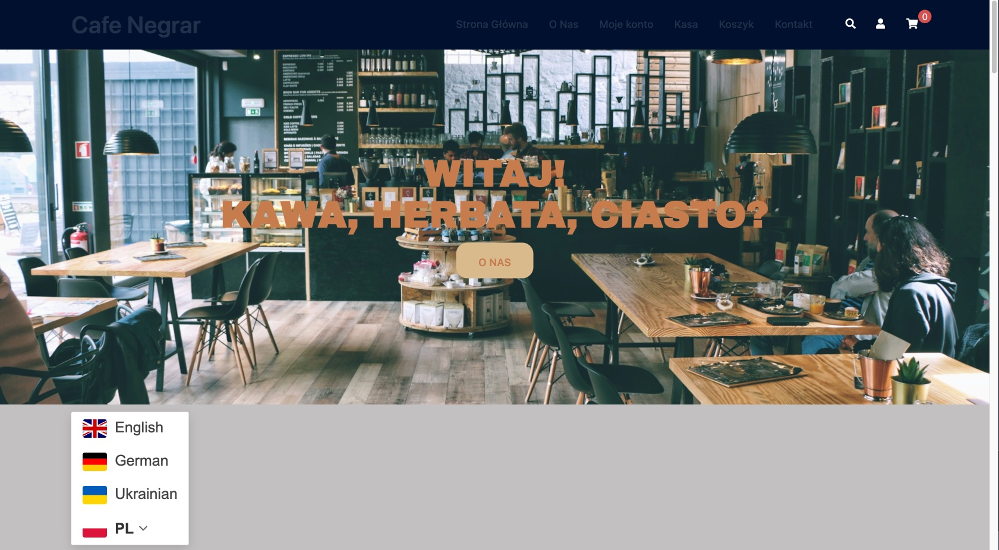
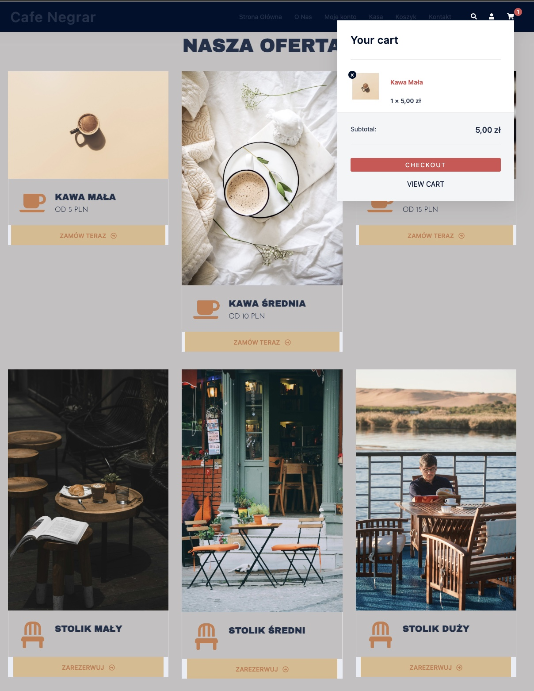
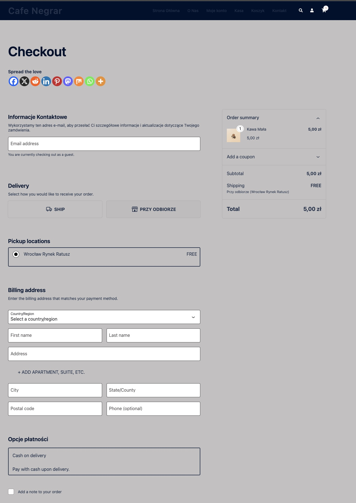
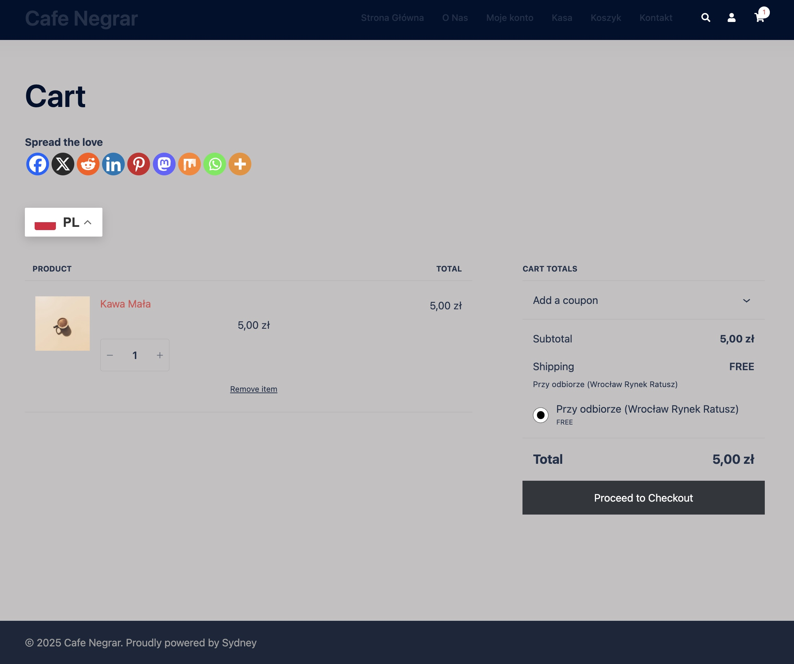
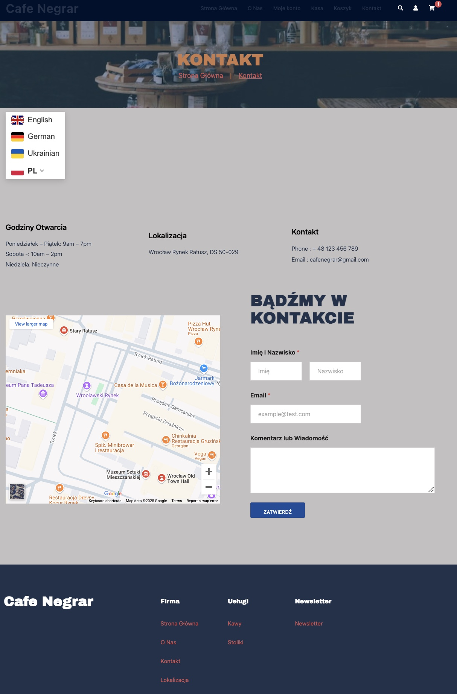
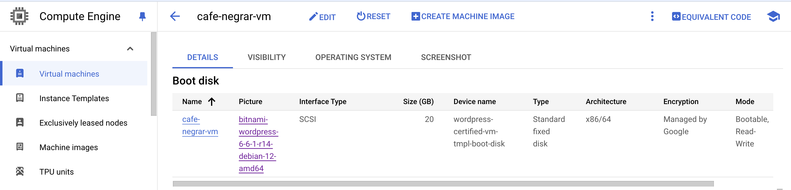
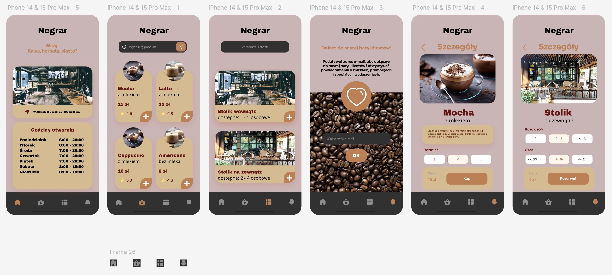
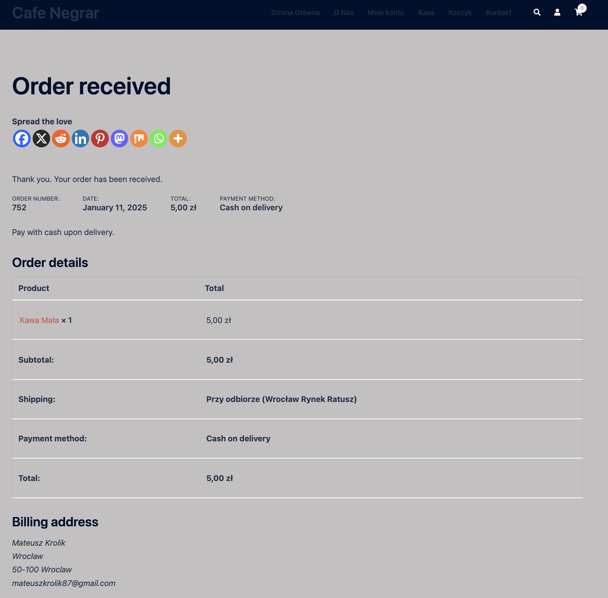
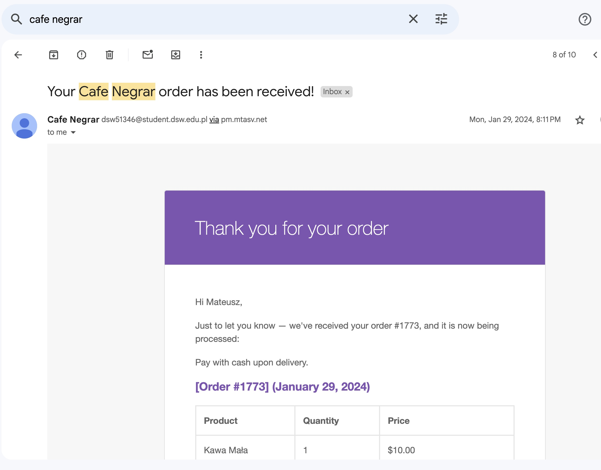
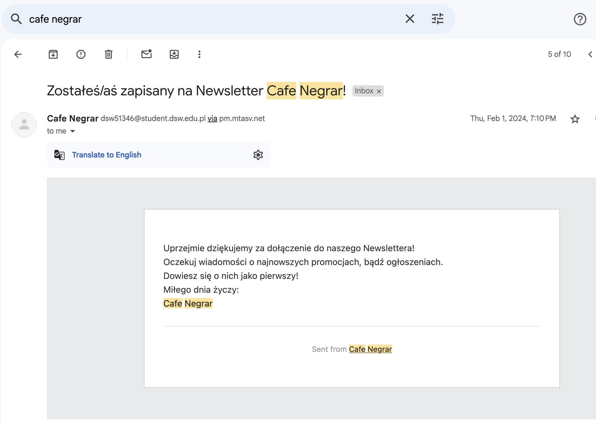

[![Contributors][contributors-shield]][contributors-url]
[![Forks][forks-shield]][forks-url]
[![Stargazers][stars-shield]][stars-url]
[![Issues][issues-shield]][issues-url]
[![MIT License][license-shield]][license-url]
[![LinkedIn][linkedin-shield]][linkedin-url]

<!-- PROJECT LOGO -->
 

  

<h3 align="center">WordPress LAMP Stack Cafe E-Commerce</h3>
  

     
    <a href="https://github.com/MateuszKrolik/Kotlin_WordPress_Cafe_Negrar"><strong>Sprawdź dokumentację</strong></a>
     
     
    <a href="https://github.com/MateuszKrolik/WordPress_Cafe_Negrar">Sprawdź Demo</a>
    ·
    <a href="https://github.com/MateuszKrolik/WordPress_Cafe_Negrar/issues">Zgłoś Buga</a>
    ·
    <a href="https://github.com/MateuszKrolik/WordPress_Cafe_Negrar/issues">Zrequestuj Feature</a>
  

<!-- TABLE OF CONTENTS -->

  
Spis treści

  <ol>
    <li>
      <a href="#about-the-project">About The Project</a>
      <ul>
        <li><a href="#built-with">Zbudowane przy uzyciu</a></li>
      </ul>
    </li>
    <li><a href="#roadmap">Roadmap</a></li>
    <li><a href="#license">License</a></li>
    <li><a href="#contact">Kontakt</a></li>
    <li><a href="#acknowledgments">Podziękowanie</a></li>
  </ol>

<!-- ABOUT THE PROJECT -->

### Po prostu odwiedź stronę [tutaj](https://mkrolik-cafe-negrar.live/)

### Lub spójrz na ponizsze screenshoty, aby zobaczyć sklep w akcji 😉

#### 1. Strona Główna z Picker'em językowym:

#### 2. Lista produktów WooCommerce z mozliwością podglądu koszyka w Nawigacji:

#### 3. Formularz Newsletter bazujący na protokole SMTP oraz Footer:

#### 4. Strona rozliczeniowa WooCommerce:

#### 5. Strona koszyka WooCommerce:

#### 6. Strona Kontaktowa z Formularzem Mailingowym oraz Integracją Google-Maps:

#### 7. Hosting za pośrednictwem Instancji Maszyny Wirtualnej na GCP z uzyciem zarzadzanej platformy Bitnami (w tym Serwer Apache, System Operacyjny Debian & Baza Danych MySQL):

#### 8. Design w Figmie (Adrian Koryciński)

#### 9. Potwierdzenie zamówienia

#### 10. Potwierdzenie zamówienia drogą mailową

#### 11. Potwierdzenie zapisu na newsletter drogą mailową

(<a href="#readme-top">back to top</a>)

### Zbudowane przy uzyciu

<!-- Primary Technologies -->

- [![WordPress][WordPress]][WordPress-url]
- [![Apache][Apache]][Apache-url]

<!-- Programming Languages -->

- [![PHP][PHP]][PHP-url]

<!-- Operating Systems -->

- [![Linux][Linux]][Linux-url]

<!-- Database Technologies -->

- [![MySQL][MySQL]][MySQL-url]
- [![SQL][SQL]][SQL-url]

<!-- Cloud Technologies -->

- [![GCP][GCP]][GCP-url]
- [![GCP Compute Engine][GCP Compute Engine]][GCP Compute Engine-url]

<!-- Containerization -->

- [![Docker][Docker]][Docker-url]
- [![Linux/Unix][Linux/Unix]][Linux/Unix-url]
- [![Bash][Bash]][Bash-url]

<!-- Version Control -->

- [![Git][Git]][Git-url]

<!-- Data Formats -->

- [![YAML][YAML]][YAML-url]

<!-- Environment Configuration -->

- [![.env][.env]][.env-url]

<!-- Email Services -->

- [![Gmail][Gmail]][Gmail-url]

(<a href="#readme-top">back to top</a>)

<!-- ROADMAP -->

## Feature Roadmap

- [x] Lokalny Development z Docker-Compose
- [x] Wdrozenie w Serwis Chmurowy GCP Compute Engine z Bitnami za pomocą wtyczki All-in-One
- [x] Low-code Development (kod tylko jako konfiguracja wdrozeniowa)
- [x] No-Code Development - Elementor jako graficzny edytor bloków
- [x] Stos technologiczny: WordPress oraz LAMP Stack (Linux, Apache, MySQL, PHP)
- [x] Certyfikat SSL do serwowania strony poprzez HTTPS
- [x] Kontrola Wersji i Źródła (dzięki woluminom Docker-Compose)
- [x] Internacjonalizacja - Wsparcie dla wielu języków
- [x] Funkcjonalność Mailingowa dzięki Protokołowi SMTP oraz serwisowi SendGrid
- [x] Integracja z Mapami Google
- [x] Funkcjonalność sklepu E-Commerce dzięki wtyczce Woo-Commerce
- [x] Zmienne środowiskowe .ENV dla bezpieczeństwa danych wrazliwych
- [x] Testy skanujące w OWASP ZAP (Adrian Koryciński)
- [x] Design w Figmie (Adrian Koryciński)

See the [open issues](https://github.com/MateuszKrolik/WordPress_Cafe_Negrar/issues) for a full list of proposed features (and known issues).

(<a href="#readme-top">back to top</a>)

<!-- LICENSE -->

## License

Distributed under the MIT License. See `LICENSE` for more information.

(<a href="#readme-top">back to top</a>)

<!-- CONTACT -->

## Kontakt

Mateusz Królik - [Mateusz Królik](https://www.linkedin.com/in/mateusz-kr%C3%B3lik-8b1862262/) - [mateuszkrolik87@gmail.com](mailto:mateuszkrolik7@gmail.com)

#### Design & OWASP ZAP Testing:

Adrian Koryciński - [Adrian Koryciński](https://www.linkedin.com/in/adriankk/)

GitHub Repository Link: [GitHub Repository Link](https://github.com/MateuszKrolik/WordPress_Cafe_Negrar)

(<a href="#readme-top">back to top</a>)

<!-- ACKNOWLEDGMENTS -->

## Acknowledgments

- [Img Shields](https://shields.io)
- [GitHub Emoji Cheat Sheet](https://www.webpagefx.com/tools/emoji-cheat-sheet)
- [Malven's Flexbox Cheatsheet](https://flexbox.malven.co/)
- [Malven's Grid Cheatsheet](https://grid.malven.co/)
- [SVG Repo](https://www.svgrepo.com/)

(<a href="#readme-top">back to top</a>)

<!-- MARKDOWN LINKS & IMAGES -->
<!-- https://www.markdownguide.org/basic-syntax/#reference-style-links -->

[contributors-shield]: https://img.shields.io/github/contributors/MateuszKrolik/WordPress_Cafe_Negrar.svg?style=for-the-badge
[contributors-url]: https://github.com/MateuszKrolik/WordPress_Cafe_Negrar/graphs/contributors
[forks-shield]: https://img.shields.io/github/forks/MateuszKrolik/WordPress_Cafe_Negrar.svg?style=for-the-badge
[forks-url]: https://github.com/MateuszKrolik/WordPress_Cafe_Negrar/network/members
[stars-shield]: https://img.shields.io/github/stars/MateuszKrolik/WordPress_Cafe_Negrar.svg?style=for-the-badge
[stars-url]: https://github.com/MateuszKrolik/WordPress_Cafe_Negrar/stargazers
[issues-shield]: https://img.shields.io/github/issues/MateuszKrolik/WordPress_Cafe_Negrar.svg?style=for-the-badge
[issues-url]: https://github.com/MateuszKrolik/WordPress_Cafe_Negrar/issues
[license-shield]: https://img.shields.io/github/license/MateuszKrolik/WordPress_Cafe_Negrar.svg?style=for-the-badge
[license-url]: https://github.com/MateuszKrolik/WordPress_Cafe_Negrar/blob/master/LICENSE
[linkedin-shield]: https://img.shields.io/badge/-LinkedIn-black.svg?style=for-the-badge&logo=linkedin&colorB=555
[linkedin-url]: https://linkedin.com/in/mateusz-królik-8b1862262
[product-screenshot]: images/screenshot.gif
[Docker]: https://img.shields.io/badge/Docker-2CA5E0?style=for-the-badge&logo=docker&logoColor=white
[Docker-url]: https://www.docker.com/
[Linux/Unix]: https://img.shields.io/badge/Linux-FCC624?style=for-the-badge&logo=linux&logoColor=black
[Linux/Unix-url]: https://www.linux.org/
[Google Cloud Platform]: https://img.shields.io/badge/Google_Cloud-4285F4?style=for-the-badge&logo=google-cloud&logoColor=white
[Google Cloud Platform-url]: https://cloud.google.com/
[Bash]: https://img.shields.io/badge/Bash-4EAA4B?style=for-the-badge&logo=gnu-bash&logoColor=white
[Bash-url]: https://www.gnu.org/software/bash/
[SQL]: https://img.shields.io/badge/SQL-4479A1?style=for-the-badge&logo=data:image/svg+xml;base64,PHN2ZyB4bWxucz0iaHR0cDovL3d3dy53My5vcmcvMjAwMC9zdmciIHhtbG5zOnhsaW5rPSJodHRwOi8vd3d3LnczLm9yZy8xOTk5L3hsaW5rIiB2aWV3Qm94PSIwIDAgNjEgODEiIGZpbGw9IiNmZmYiIGZpbGwtcnVsZT0iZXZlbm9kZCIgc3Ryb2tlPSIjMDAwIiBzdHJva2UtbGluZWNhcD0icm91bmQiIHN0cm9rZS1saW5lam9pbj0icm91bmQiPjx1c2UgeGxpbms6aHJlZj0iI0EiIHg9Ii41IiB5PSIuNSIvPjxzeW1ib2wgaWQ9IkEiIG92ZXJmbG93PSJ2aXNpYmxlIj48ZyBmaWxsPSIjMDA3MmM2IiBzdHJva2U9Im5vbmUiPjxwYXRoIGQ9Ik0wIDEwLjkyOXY1OC4xNEMwIDc1LjEwNiAxMy40MzIgODAgMzAgODBWMTAuOTI5SDB6Ii8+PHVzZSB4bGluazpocmVmPSIjQyIvPjwvZz48dXNlIHhsaW5rOmhyZWY9IiNDIiBvcGFjaXR5PSIuMTUiIHN0cm9rZT0ibm9uZSIvPjxwYXRoIGQ9Ik02MCAxMC45MjljMCA2LjAzNi0xMy40MzIgMTAuOTI5LTMwIDEwLjkyOVMwIDE2Ljk2NSAwIDEwLjkyOSAxMy40MzIgMCAzMCAwczMwIDQuODkzIDMwIDEwLjkyOSIgc3Ryb2tlPSJub25lIi8+PHBhdGggZD0iTTUzLjg2NiAxMC4yOTljMCAzLjk4NS0xMC42ODUgNy4yMTEtMjMuODY2IDcuMjExUzYuMTMyIDE0LjI4NCA2LjEzMiAxMC4yOTkgMTYuODE5IDMuMDg4IDMwIDMuMDg4czIzLjg2NiAzLjIyOCAyMy44NjYgNy4yMTEiIGZpbGw9IiM3ZmJhMDAiIHN0cm9rZT0ibm9uZSIvPjxwYXRoIGQ9Ik00OC44NjcgMTQuNzA3YzMuMTI0LTEuMjE5IDUuMDAyLTIuNzQ1IDUuMDAyLTQuNDA0QzUzLjg2OCA2LjMxOCA0My4xODMgMy4wOSAzMCAzLjA5UzYuMTM0IDYuMzE4IDYuMTM0IDEwLjMwM2MwIDEuNjU4IDEuODc3IDMuMTg1IDUuMDAyIDQuNDA0IDQuMzYzLTEuNzA0IDExLjE4Mi0yLjgwMyAxOC44NjUtMi44MDNzMTQuNSAxLjA5OSAxOC44NjYgMi44MDMiIGZpbGw9IiNiOGQ0MzIiIHN0cm9rZT0ibm9uZSIvPjxwYXRoIGQ9Ik0yMC40NzIgNTEuMjg3YzAgMS44MDctLjY1MSAzLjIwNi0xLjk1NSA0LjE5N3MtMy4xMDIgMS40ODgtNS4zOTkgMS40ODhjLTEuOTU0IDAtMy41ODctLjM1NC00Ljg5OS0xLjA2M3YtNC4yNTFjMS41MTQgMS4yOTMgMy4xODIgMS45NCA1LjAwNCAxLjk0Ljg4IDAgMS41NjEtLjE3NyAyLjA0MS0uNTMycy43Mi0uODIzLjcyLTEuNDA5YzAtLjU3NS0uMjMxLTEuMDc1LS42OTMtMS41cy0xLjQwMi0uOTc0LTIuODE5LTEuNjQ3Yy0yLjg4OC0xLjM2Mi00LjMzMS0zLjIyNC00LjMzMS01LjU3NyAwLTEuNzA4LjYyOS0zLjA3OCAxLjg4OS00LjExczIuOTMxLTEuNTQ3IDUuMDE2LTEuNTQ3YzEuODQ5IDAgMy4zNzkuMjQ1IDQuNTk2LjczMXYzLjk3MWMtMS4yNzYtLjg4Ni0yLjcyOS0xLjMyOC00LjM1Ny0xLjMyOC0uODE4IDAtMS40NjUuMTc0LTEuOTQuNTIzYTEuNjUgMS42NSAwIDAgMC0uNzEyIDEuNDAxYzAgLjYwMi4xOTEgMS4wOTYuNTc1IDEuNDgxczEuMTY4Ljg2MSAyLjM1NiAxLjQyOGMxLjc3Ljg0MiAzLjAzIDEuNjk1IDMuNzg0IDIuNTYzczEuMTI1IDEuOTUgMS4xMjUgMy4yNDF6bTIwLjM3LTQuMzAyYzAgMi4yNC0uNTA3IDQuMTg1LTEuNTE5IDUuODNzLTIuNDM4IDIuODAxLTQuMjc3IDMuNDY2bDUuNDkxIDUuMTEzaC01LjU0NGwtMy45MjEtNC40MjNjLTEuNjgxLS4wNjEtMy4xOTgtLjUwOS00LjU0OS0xLjM0MXMtMi4zOTUtMS45NzItMy4xMjktMy40Mi0xLjEwMy0zLjA2Mi0xLjEwMy00Ljg0MWMwLTEuOTc0LjM5OC0zLjczNCAxLjE5NC01LjI3OXMxLjkxNi0yLjczNCAzLjM2LTMuNTY2IDMuMDk3LTEuMjQ4IDQuOTY1LTEuMjQ4YzEuNzQxIDAgMy4zMDIuNDAzIDQuNjggMS4yMDlzMi40NDYgMS45NTEgMy4yMDggMy40MzkgMS4xNDQgMy4xNzUgMS4xNDQgNS4wNnptLTQuNDg4LjI0YzAtMS45MzEtLjQxOC0zLjQ1NS0xLjI1NS00LjU3NnMtMS45OC0xLjY4MS0zLjQzMy0xLjY4MWMtMS40NzkgMC0yLjY2Mi41NjItMy41NTIgMS42ODVzLTEuMzMzIDIuNjIxLTEuMzMzIDQuNDg5YzAgMS44Ni40MzUgMy4zNDQgMS4zMDYgNC40NTVzMi4wMjggMS42NjYgMy40NzIgMS42NjZjMS40NzEgMCAyLjYzNi0uNTM4IDMuNDk5LTEuNjEzczEuMjk2LTIuNTUgMS4yOTYtNC40MjZ6bTE4Ljg5MyA5LjQxNEg0My45NzJWMzcuNTk2aDQuMjY0VjUzLjE2aDcuMDF6IiBzdHJva2U9Im5vbmUiLz48L3N5bWJvbD48ZGVmcyA+PHBhdGggaWQ9IkMiIGQ9Ik0yOS41ODkgNzkuOTk5SDMwYzE2LjU2OCAwIDMwLTQuODkyIDMwLTEwLjkyOXYtNTguMTRIMjkuNTg5djY5LjA3eiIvPjwvZGVmcz48L3N2Zz4=
[SQL-url]: https://en.wikipedia.org/wiki/SQL
[YAML]: https://img.shields.io/badge/YAML-000000?style=for-the-badge&logo=yaml&logoColor=white
[YAML-url]: https://yaml.org/
[.env]: https://img.shields.io/badge/.env-5A9?style=for-the-badge&logo=dotenv&logoColor=white
[.env-url]: https://github.com/motdotla/dotenv
[Gmail]: https://img.shields.io/badge/Gmail-D14836?style=for-the-badge&logo=gmail&logoColor=white
[Gmail-url]: https://mail.google.com/
[WordPress]: https://img.shields.io/badge/WordPress-21759B?style=for-the-badge&logo=wordpress&logoColor=white
[WordPress-url]: https://wordpress.org/
[Linux]: https://img.shields.io/badge/Linux-FCC624?style=for-the-badge&logo=linux&logoColor=black
[Linux-url]: https://www.linux.org/
[MySQL]: https://img.shields.io/badge/MySQL-4479A1?style=for-the-badge&logo=mysql&logoColor=white
[MySQL-url]: https://www.mysql.com/
[PHP]: https://img.shields.io/badge/PHP-777BB4?style=for-the-badge&logo=php&logoColor=white
[PHP-url]: https://www.php.net/
[GCP]: https://img.shields.io/badge/GCP-4285F4?style=for-the-badge&logo=google-cloud&logoColor=white
[GCP-url]: https://cloud.google.com/
[Compute Engine]: https://img.shields.io/badge/Compute_Engine-4285F4?style=for-the-badge&logo=google-cloud&logoColor=white
[Compute Engine-url]: https://cloud.google.com/compute
[Git]: https://img.shields.io/badge/Git-F05032?style=for-the-badge&logo=git&logoColor=white
[Git-url]: https://git-scm.com/
[Apache-url]: https://httpd.apache.org/
[Apache]: https://img.shields.io/badge/Apache-D22128?style=for-the-badge&logo=apache&logoColor=white
[GCP Compute Engine]: https://img.shields.io/badge/GCP_Compute_Engine-4285F4?style=for-the-badge&logo=data:image/svg+xml;base64,PHN2ZyB4bWxucz0iaHR0cDovL3d3dy53My5vcmcvMjAwMC9zdmciIHhtbG5zOnhsaW5rPSJodHRwOi8vd3d3LnczLm9yZy8xOTk5L3hsaW5rIiB2aWV3Qm94PSIwIDAgODEgODEiIGZpbGw9IiNmZmYiIGZpbGwtcnVsZT0iZXZlbm9kZCIgc3Ryb2tlPSIjMDAwIiBzdHJva2UtbGluZWNhcD0icm91bmQiIHN0cm9rZS1saW5lam9pbj0icm91bmQiPjx1c2UgeGxpbms6aHJlZj0iI0EiIHg9Ii41IiB5PSIuNSIvPjxzeW1ib2wgaWQ9IkEiIG92ZXJmbG93PSJ2aXNpYmxlIj48ZyBzdHJva2U9Im5vbmUiIGZpbGwtcnVsZT0ibm9uemVybyI+PHBhdGggZD0iTTI4IDI4aDI0djI0SDI4eiIgZmlsbD0iI2FlY2JmYSIvPjxwYXRoIGQ9Ik0zNiAwaDh2MTZoLTh6TTIwIDBoOHYxNmgtOHptMzIgMGg4djE2aC04eiIgZmlsbD0iIzY2OWRmNiIvPjxwYXRoIGQ9Ik0zNiA2NGg4djE2aC04em0tMTYgMGg4djE2aC04em0zMiAwaDh2MTZoLTh6bTEyLTIwdi04aDE2djh6bTAgMTZ2LThoMTZ2OHptMC0zMnYtOGgxNnY4eiIgZmlsbD0iIzQyODVmNCIvPjxwYXRoIGQ9Ik0wIDQ0di04aDE2djh6bTAgMTZ2LThoMTZ2OHptMC0zMnYtOGgxNnY4eiIgZmlsbD0iIzY2OWRmNiIvPjxwYXRoIGQ9Ik0xMiAxMnY1Nmg1NlYxMnptNDggNDhIMjBWMjBoNDB6IiBmaWxsPSIjYWVjYmZhIi8+PHBhdGggZD0iTTI4IDUyaDI0TDQwIDQwIDI4IDUyeiIgZmlsbD0iIzY2OWRmNiIvPjxwYXRoIGQ9Ik00MCA0MGwxMiAxMlYyOEw0MCA0MHoiIGZpbGw9IiM0Mjg1ZjQiLz48L2c+PC9zeW1ib2w+PC9zdmc+
[GCP Compute Engine-url]: https://cloud.google.com/compute
